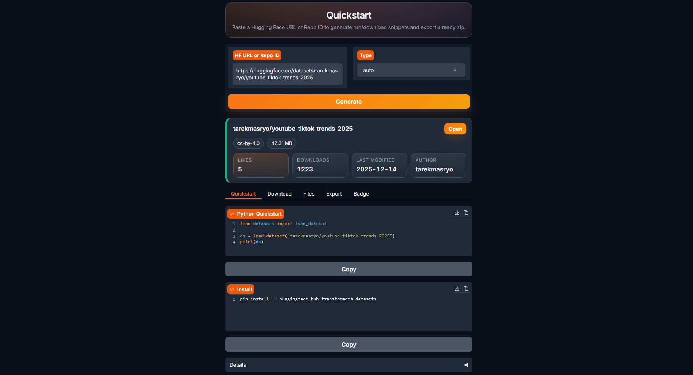

# ⚡ QuickStart — Hugging Face Repo Quickstart Kit

QuickStart is a **Gradio** app that converts any Hugging Face **URL** or **Repo ID** into clean, copy-ready **first‑run artifacts** (best‑effort).

[](https://www.gradio.app/)


[](https://huggingface.co/spaces/tarekmasryo/QuickStart)

**Live demo:** https://huggingface.co/spaces/tarekmasryo/QuickStart

---

## Preview



---

## Why QuickStart?

Starting a repo can be messy (different repo types, different download flows, gated/private repos, large artifacts).
QuickStart standardizes the **first 5 minutes** into a repeatable workflow.

---

## Features

- **Type-aware**: Model / Dataset / Space (auto or manual)
- **Run snippet** *(best‑effort)* based on Hub metadata
- **Download recipes**
  - Python: `snapshot_download()`
  - CLI: `huggingface-cli download`
- **Files view** *(best‑effort, limited)* + quick filter
- **Risk hints** *(filename-based only)* for suspicious patterns and common artifact types
- **Export zip** with a minimal runnable scaffold

---

## Supported inputs

**Repo ID**
```text
<owner>/<repo>
```

**URLs**
```text
https://huggingface.co/<owner>/<repo>
https://huggingface.co/datasets/<owner>/<repo>
https://huggingface.co/spaces/<owner>/<repo>
```

Also accepted:
```text
datasets/<owner>/<repo>
spaces/<owner>/<repo>
```

---

## Run locally

```bash
git clone https://github.com/tarekmasryo/QuickStart.git
cd QuickStart

python -m venv .venv
# Windows:
.venv\Scripts\activate
# macOS/Linux:
source .venv/bin/activate

pip install -U pip
pip install -r requirements.txt

python app.py
```

---

## Private / gated repos (optional)

You only need `HF_TOKEN` if the target repo is **private** or **gated**.

Windows (PowerShell):
```bash
setx HF_TOKEN "YOUR_TOKEN"
```
Restart the terminal.

macOS/Linux:
```bash
export HF_TOKEN="YOUR_TOKEN"
```

Or login once:
```bash
huggingface-cli login
```

On Hugging Face Spaces:
- Space **Settings → Secrets**
- Add: `HF_TOKEN` = your token

---

## Export output (zip contract)

```text
run.py
download.py
requirements.txt
.env.example
README.md
```

---

## Risk hints (not an audit)

Risk hints are **filename-based only**:
- ✅ flags `.env`, `token`, `api_key`, `credentials`, key files, etc.
- ✅ highlights artifact extensions like `.safetensors`, `.bin`, `.onnx`, `.gguf`
- ❌ does not scan file contents
- ❌ not a security/compliance audit

---

## License

Apache-2.0

**Author:** Tarek Masryo
